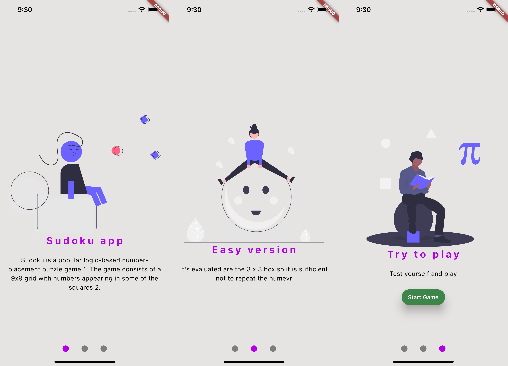
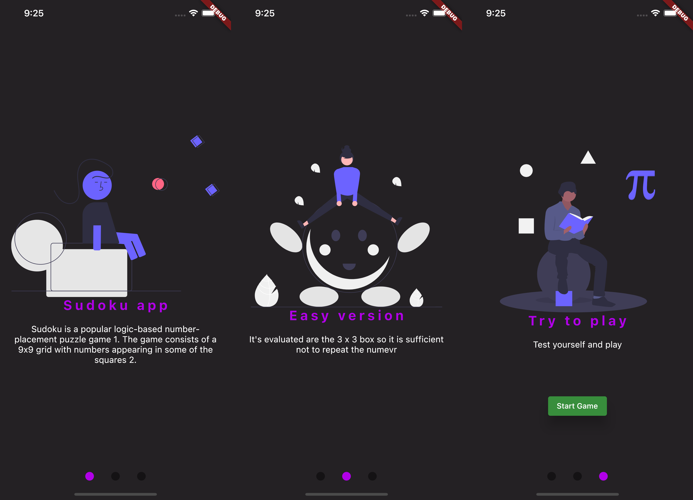
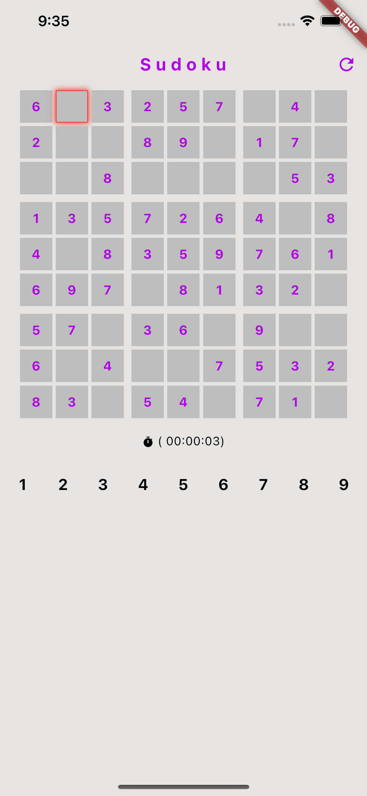
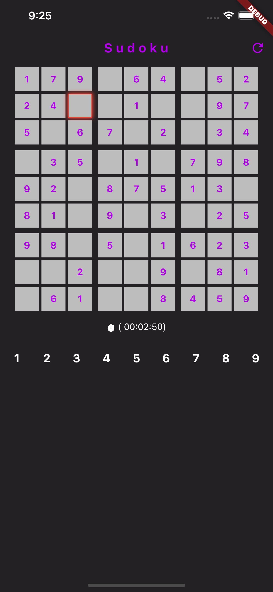

# sudoku_app

Easy sudoku app.

## Rules

Principal rules:

- In each 3 x 3 square there must be no duplicates.
- once a number is entered, it cannot be changed

## Library

- sudoku_solver_generator: ^2.1.0+1
- bloc: ^8.1.2
- flutter_bloc: ^8.1.3
- collection: ^1.17.1
- flutter_svg: ^2.0.7
- shared_preferences: ^2.1.2

## Credits

- **Argument project:** [Fudeo](https://www.fudeo.it)
- **Algorithm game:** [sudoku_solver_generator: ^2.1.0+1](https://pub.dev/documentation/sudoku_solver_generator/latest/)
- **Grafics welcome scrren:** [undraw](https://undraw.co/)

## Aspect
 

 
